

  

<h1 align="center">Home Organizer (HO) </h1>

  <strong>The complete AI-powered home inventory system for Home Assistant</strong>

  
  
  
  

---

Home Organizer is a dedicated full-screen application for your Home Assistant sidebar. It allows you to manage your home inventory with ease using nested folders, live stock tracking, and a powerful **Google Gemini AI** integration that can read receipts, auto-categorize items, and chat with you in natural language.

**Developed by Guy Azaria.**

## ✨ Features

### 🤖 Advanced AI Capabilities
* **Receipt & Invoice Scanning** — Snap a photo or upload a PDF of your grocery receipt. The AI will automatically extract all items, quantities, and intelligently map them to your existing home locations.
* **Auto-Categorization & Icons** — The AI automatically assigns the correct Main Category, Sub-category, Measurement Unit (Kg, Liter, Units), and a beautiful 3D icon to every item it processes.
* **Smart "Review" Pipeline** — AI-extracted items go into a secure "Review Tab." You can check, edit, confirm, or reject the AI's imports before they are permanently added to your inventory.
* **Conversational Assistant** — Ask the AI questions based on your actual inventory: *"What can I make for breakfast?"*, *"Where are the winter blankets?"*, or *"Do we have any AAA batteries?"*
* **Native Multilingual Support** — Chat with the AI in English, Hebrew, Arabic, or any other language. The AI auto-detects your language and replies in the exact same language seamlessly.

### 📦 Smart Inventory Management
* **Hierarchical Explorer** — Navigate through Rooms, Furniture, Shelves, and Boxes with unlimited depth.
* **Live Stock Tracking** — Instantly update stock levels with quick-action buttons.
* **Shopping Mode** — A dedicated view for out-of-stock items, organized by location, with collapsible categories and badge counters.
* **Date Tracking** — Track when items were added and filter by day, week, month, or year.
* **Management Tools** — Easy Rename, Move (Cut/Paste), Duplicate, and Delete functions.

### 📸 Camera & Visual Tools
* **AI Background Removal** — Take photos of your items directly in the app. The built-in camera tool automatically filters out messy backgrounds to create clean, professional item thumbnails.
* **Visual Search** — Use photos to identify unknown items and locate where they are stored in your home.

### 🎨 User Experience
* **Sidebar Integration** — Installs as a native panel for easy access.
* **Theme Support** — Full support for Light and Dark modes matching your Home Assistant theme.
* **Privacy First** — All inventory data is stored locally in a fast SQLite database.

---

## 📖 User Manual & Visual Guide

Welcome to Home Organizer! This step-by-step guide will walk you through setting up your home, managing your items, and unleashing the power of the AI Assistant.

### 1. Personalizing Your Settings (Language & Themes)
Before you start, make the app your own! Click the **Gear Icon (⚙️)** in the top right corner of the navigation bar.
* **Language:** Home Organizer fully supports multiple languages natively. Select your preferred language (English, Hebrew, etc.) and the entire interface—including text direction (LTR/RTL)—will instantly adapt.
* **Theme:** Choose between a sleek **Dark Theme** (great for wall-mounted tablets) or a clean **Light Theme** depending on your preference.

  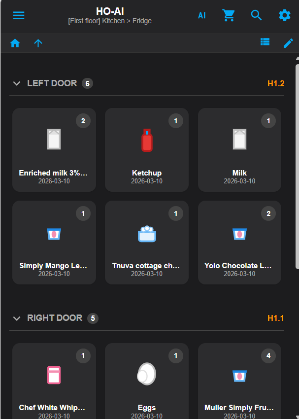
  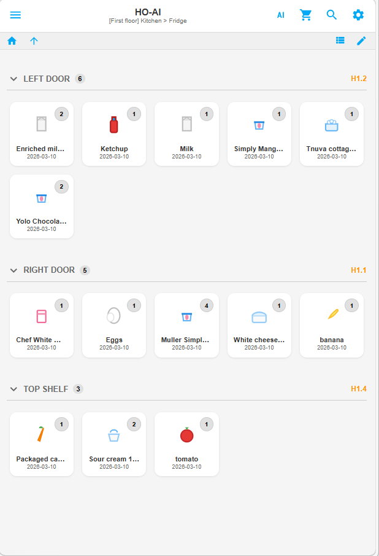

### 2. Setting up Zones and Rooms
Think of your home in broad categories first. To start building your home's layout, click the **Pencil Icon (✏️)** in the top right to enter **Edit Mode**.
* Click **Add Zone** at the bottom to create broad areas like "First Floor", "Second Floor", or "Outdoors".
* Inside those zones, click the large green **+ Add Room** button to create specific rooms like "Kitchen", "Master Bedroom", or "Garage".
* *Tip: You can use the up (↑) and down (↓) arrows to reorder your zones and rooms exactly how you want them!*

  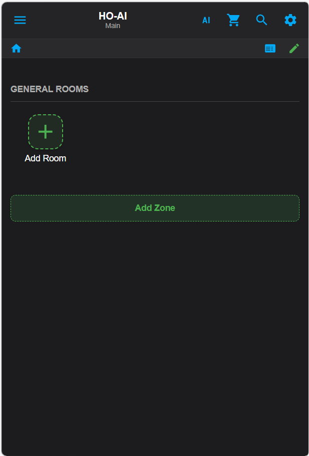
  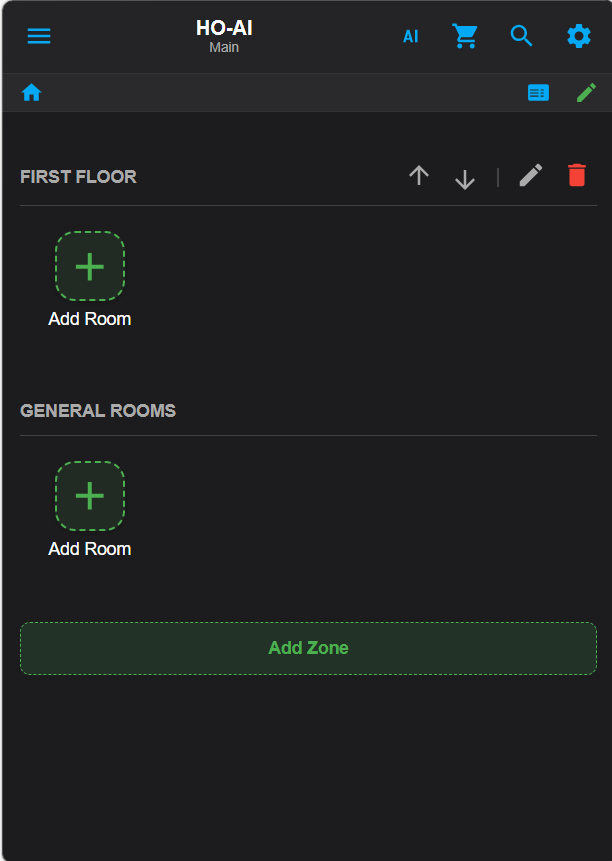
  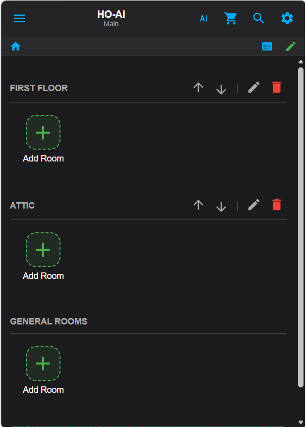

### 3. Customizing Icons
Visuals make finding things much faster. While still in **Edit Mode (✏️)**, notice the small picture icon on the corner of your room folders. 
* Click the picture icon to open the **Icon Picker**.
* Browse through hundreds of beautiful 3D icons built right into the app, organized by category.
* Don't see what you need? Use the **Upload File** button to take a picture of your actual room, or paste an image URL directly!

  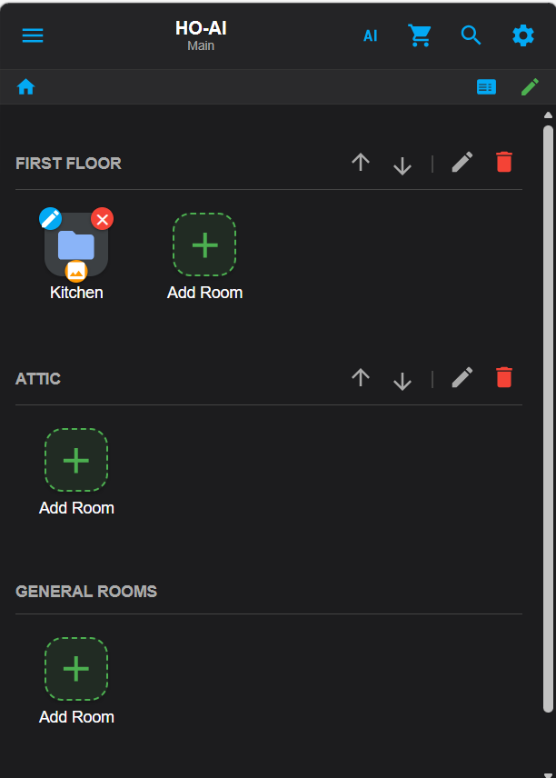
  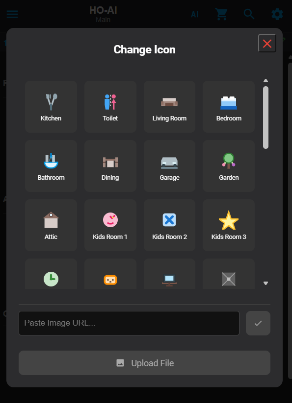

### 4. Storage Locations & Sublocations
Now let's get specific. Click on a Room (e.g., Kitchen) to enter it. 
* Add a **Storage Location** (like "Fridge" or "Pantry Cabinets").
* Click into the Fridge, and click **+ Add Sublocation** to get granular. You can create sections like "Left Door", "Right Door", or "Top Shelf". This hierarchy ensures you always know *exactly* where an item is.

  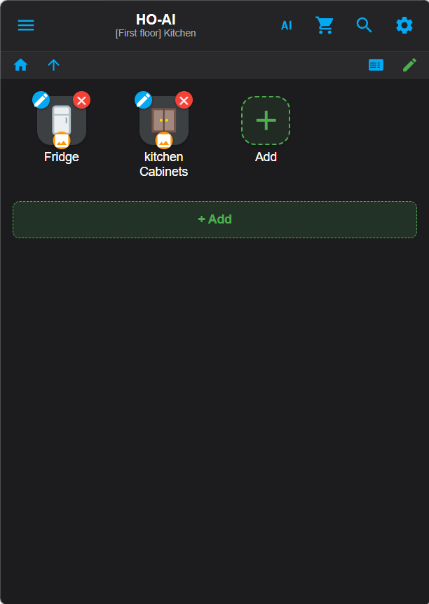
  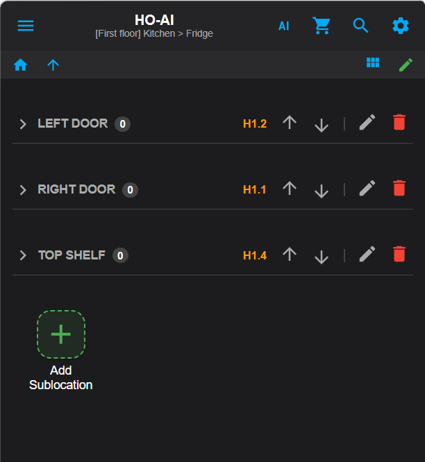

### 5. Adding and Managing Items manually
Turn off **Edit Mode** to view your items cleanly. Navigate to a sublocation and click **+ Add** to create a new item manually.
* Click on any item row to expand its **Detailed View**.
* **Categorize:** Select the Main Category (e.g., Food) and Sub-category (e.g., Sauces). 
* **Details:** Assign an expiration date, input the unit size (e.g., 500ml), or use the hierarchy dropdowns to instantly move the item to another room.
* **Media:** Click the Camera icon to snap a real photo of the item, or the Image icon to pick from the built-in library.

  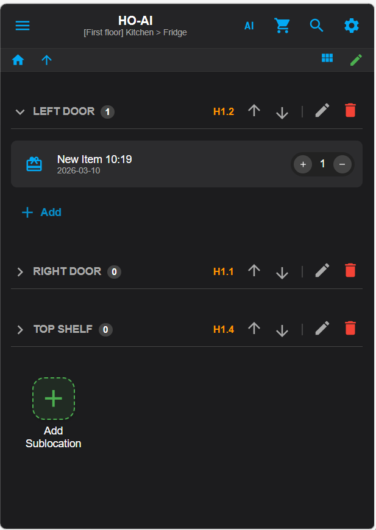
  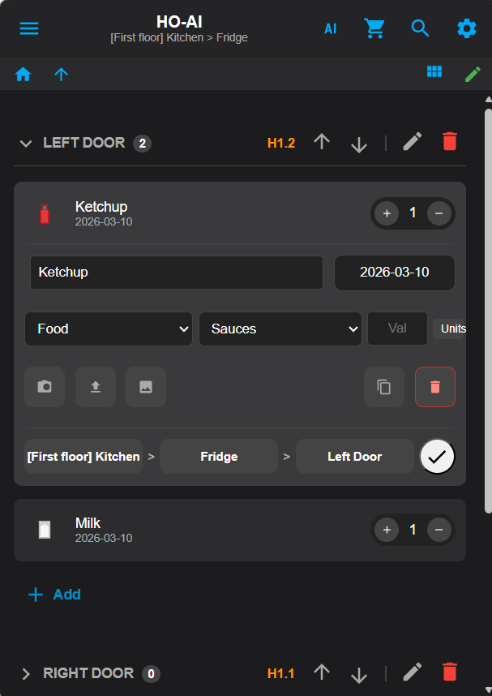
  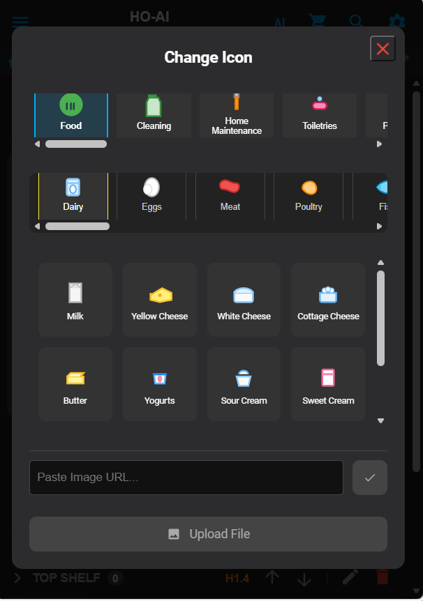

### 6. Grid View & Live Tracking
Managing stock should be effortless. Use the **View Toggle** icon in the sub-bar to switch between a detailed List View and a beautiful visual **Grid View**.
* Easily hit the **+** or **-** buttons to update how much of an item you have left. 
* When an item hits `0`, it is automatically flagged as **Out of Stock** (marked with a red badge) and sent directly to your Shopping List!

  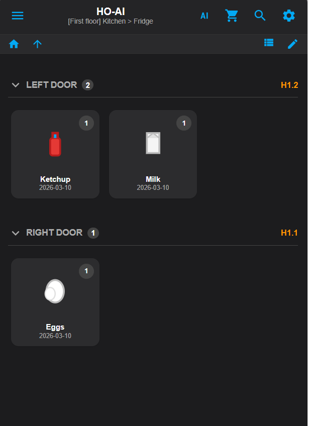
  

### 7. Fast Search
Looking for something specific? Click the **Magnifying Glass (🔍)** icon in the top bar to open the search field. Just start typing, and the app will instantly locate the item and show you the exact path (Zone > Room > Location > Sublocation) to find it!

  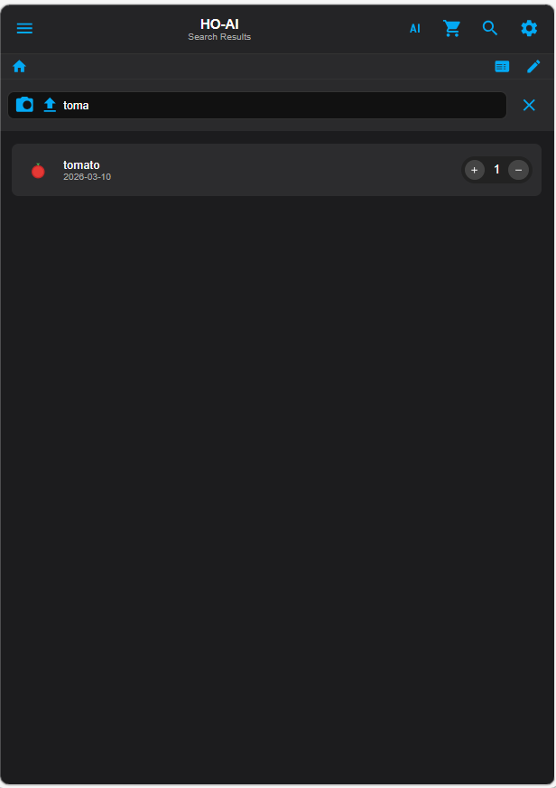

---

## 🤖 The AI Assistant: Let Home Organizer Do The Work

Why type manually when the AI can do it for you? Click the **Robot Icon (🤖)** in the top bar to open your personal AI Chat Assistant. 

### Adding Items via Text & Smart Queries
You can talk to the AI naturally. 
* Tell it: *"Add 3 batteries to the kitchen fridge."* The AI will parse your request, assign the correct category, find a battery icon, and add it to your inventory.
* **Ask for advice:** Because the AI knows exactly what is in your database, you can ask it questions! Type *"Recommend preparing breakfast from ingredients in the kitchen"*, and it will generate a recipe based *only* on the items you currently have in stock.

  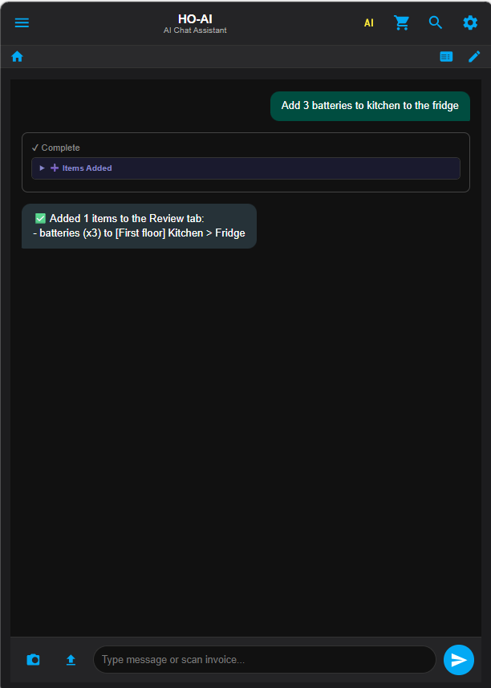
  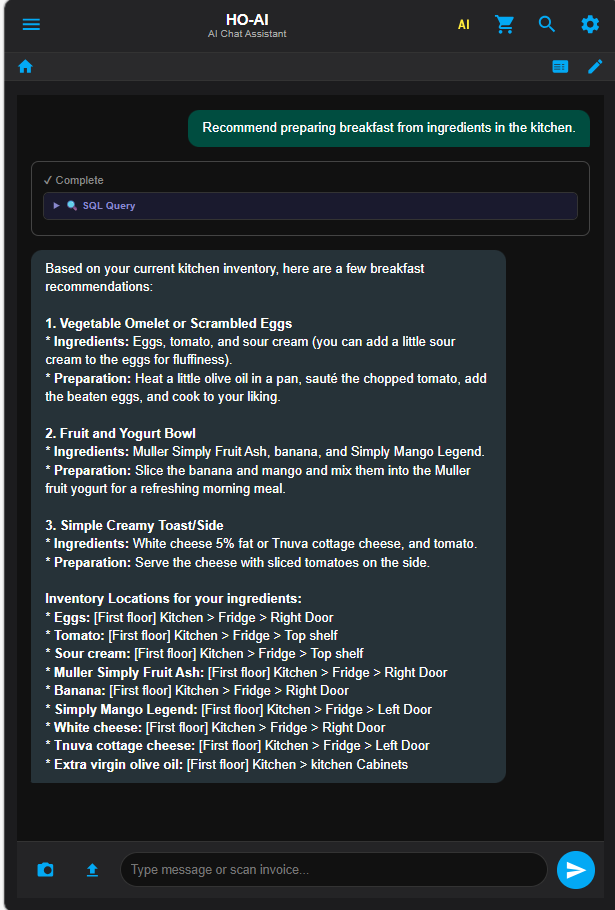

### Invoice & Receipt Scanning (Bulk Add)
Just got back from the grocery store? Don't type out 40 items by hand!
1. Open the AI Chat and click the **Camera Icon** (to take a photo) or the **Upload Icon** (to attach a saved PDF/Image).
2. You can add a prompt like *"Add these to the fridge"* or just send the image blank.
3. The AI will read the receipt, translate it, map the items to your existing rooms, apply icons, and prepare them for import.

  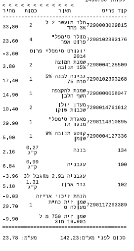
  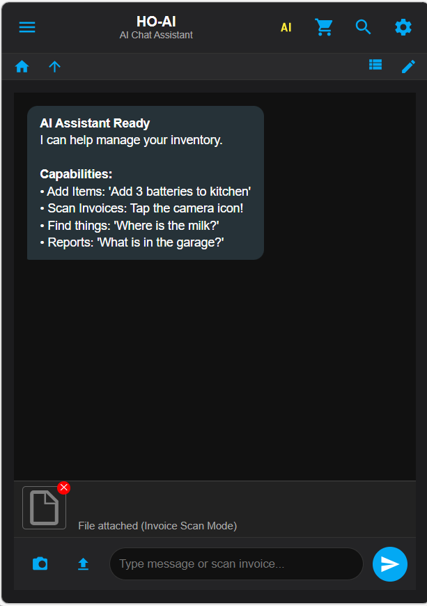
  
  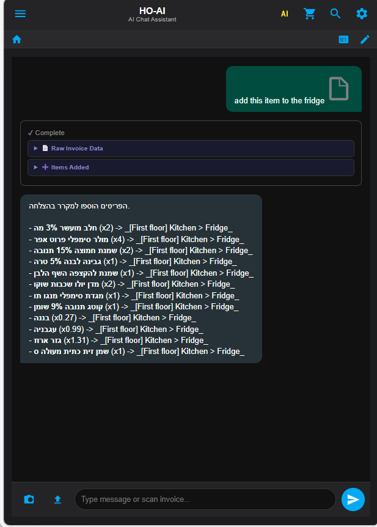

### Shopping Mode & AI Exports (Review Tab)
Click the **Shopping Cart (🛒)** icon in the top bar to enter Shopping Mode. 
* **List Tab:** Shows everything currently at `0` stock, organized by category so you can easily shop at the store.
* **AI Exports (Review) Tab:** When the AI scans a receipt or adds an item via text, it goes here first for your safety. Review what the AI extracted, adjust quantities or categories if needed, and click the **Checkmark (✅)** to officially add them to your home, or the **Trash (🗑️)** to reject them.

  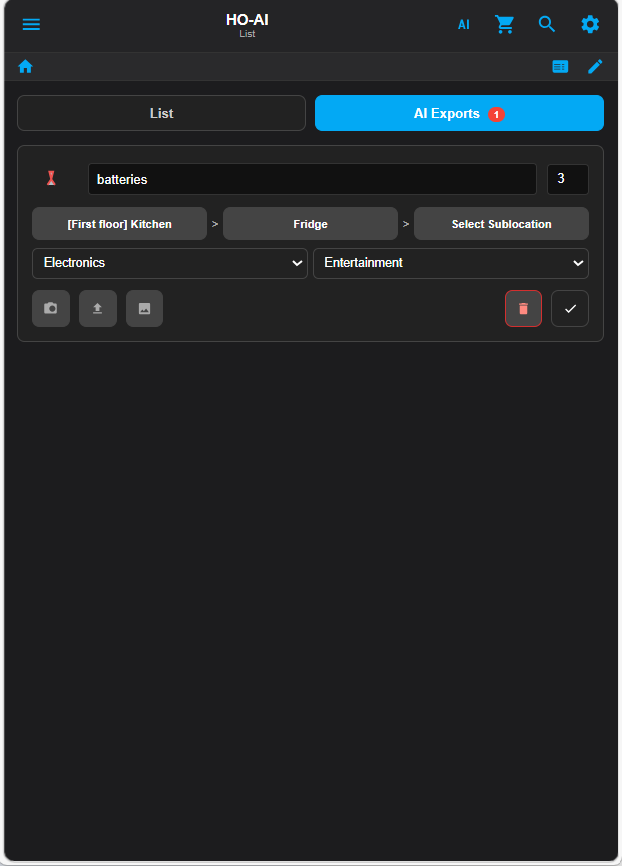
  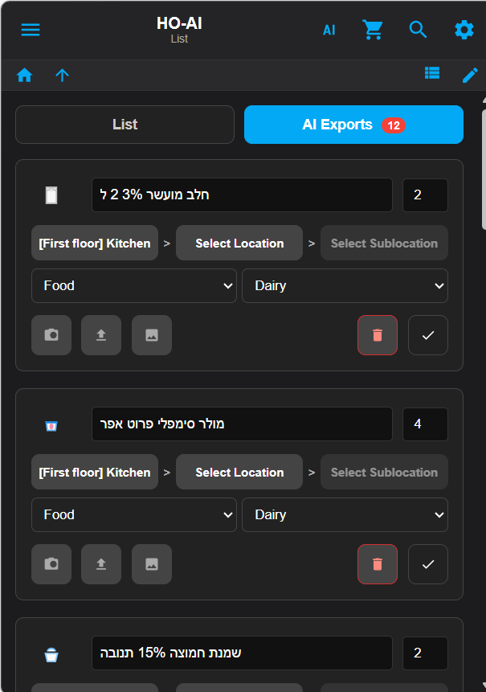

---

## 📋 Requirements

* Home Assistant 2024.1.0 or newer
* **Google Gemini API Key**: Required for all AI text chat, receipt scanning, and auto-categorization features. (Get a free API key from Google AI Studio).

## 📥 Installation

### Option 1: HACS (Recommended)
1. In Home Assistant, go to **HACS** > **Integrations**.
2. Open the menu (top right) and select **Custom repositories**.
3. Add `https://github.com/GuyAzria/home-organizer` as an **Integration**.
4. Click **Add**, find **Home Organizer**, and select **Download**.
5. **Restart Home Assistant**.

### Option 2: Manual
1. Download the `custom_components/home_organizer` folder.
2. Copy it to your `config/custom_components/` directory.
3. Restart Home Assistant.

## ⚙️ Setup

1. Navigate to **Settings** > **Devices & Services**.
2. Click **Add Integration** and search for **Home Organizer**.
3. Enter your **Google Gemini API Key** when prompted.
4. The **Organizer** icon will appear in your sidebar.

## 📄 License
This project is licensed under the MIT License. See [LICENSE](LICENSE) for details.

---

Made with ❤️ for the Home Assistant community
