

  

<h1 align="center">Home Organizer (HO)</h1>

  <strong>The complete AI-powered home inventory & smart voice assistant system for Home Assistant</strong>

  
  
  

  
  
  
  
  

---

Home Organizer is a dedicated full-screen application for your Home Assistant sidebar. It allows you to manage your home inventory with ease using nested folders, live stock tracking, and a powerful **Cloud & Local AI** integration (Gemini, OpenAI, Claude, Ollama, LM Studio) that acts as your personal home assistant.

**Developed by Guy Azria.**

---
 ## 📥 Installation (Zero YAML Required! 🎉)
There is absolutely no need to write a single line of code or touch your `configuration.yaml` file. The entire installation and setup process is handled seamlessly through the Home Assistant UI!

### Step 1: Add Custom Repository in HACS
1. In Home Assistant, go to **HACS**.
2. Open the top right menu (⋮) and select **Custom repositories**.
3. Paste `https://github.com/GuyAzria/home-organizer` into the Repository field, select **Integration** as the category, and click **ADD**.

  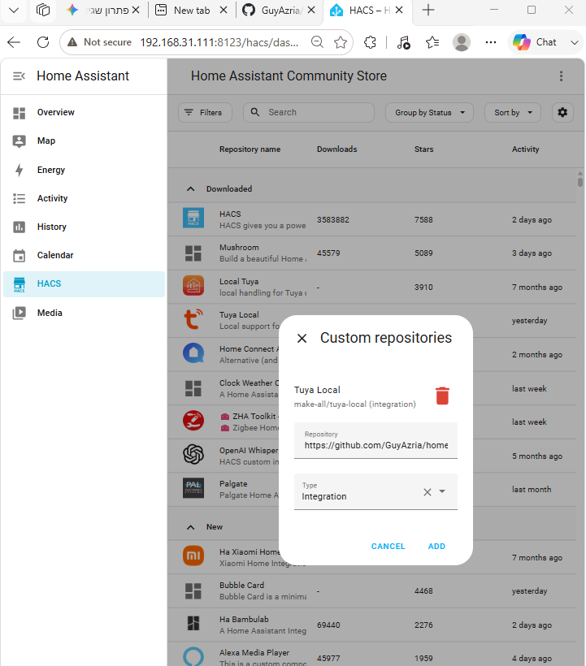
  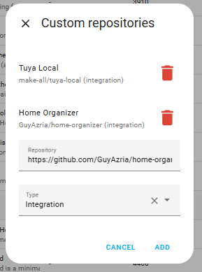

<i>Paste the GitHub URL and verify that Home Organizer is added to your custom repositories list.</i>

### Step 2: Download the Integration
Search for **Home Organizer** in the HACS search bar, click on it, and select **Download**.

  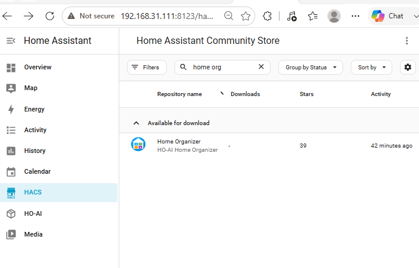

<i>Locate the HO-AI Home Organizer integration and download it to your system.</i>

### Step 3: Restart Home Assistant
Go to **Settings** > **System** (or click the repair notification) and **Restart** Home Assistant to load the new files.

  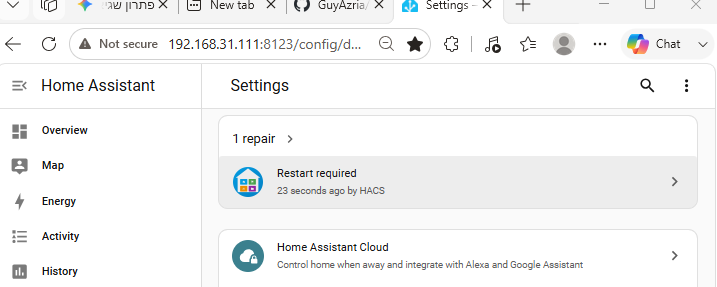

<i>A restart is required before Home Assistant can recognize the new integration.</i>

---

## ⚙️ Setup & Configuration

### Step 4: Add the Integration
Navigate to **Settings** > **Devices & Services**. Click the **+ Add Integration** button in the bottom right corner and search for **Home Organizer**.

  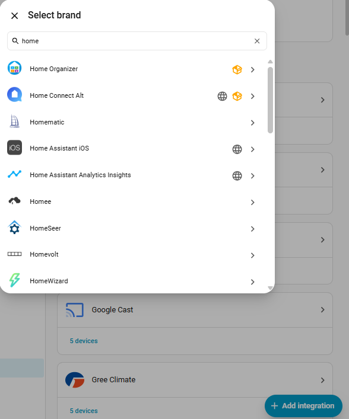

<i>Find Home Organizer in the official integrations list.</i>

### Step 5: Choose Your Architecture & Storage
The setup wizard will guide you through the initial configuration:
* **Processing Mode & AI Provider:** Choose how you want the AI to process your data—Local Only (for maximum privacy), Cloud Only, or a Hybrid approach.
* **Storage Method:** Choose where to store your database. **Highly Recommended:** Select `media` if your main Home Assistant drive is low on storage space. Because all item photos (and potentially future scanned invoices) are saved directly into the SQLite DB, the file size can grow significantly over time.

  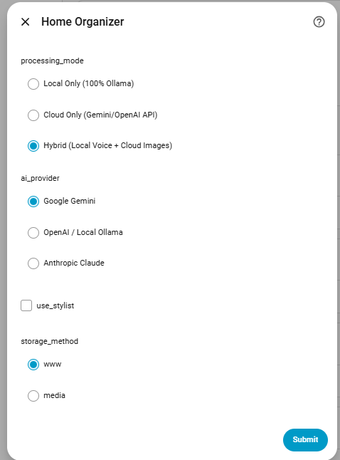

<i>Select your processing mode, primary AI provider, and preferred storage location.</i>

### Step 6: Enter API Keys & Connections
Depending on the AI provider you selected, you need to provide the correct connection details so Home Organizer can communicate with the AI:
* **Cloud Providers (Gemini/OpenAI/Claude):** Paste your secure API Key and the specific Model Name you want to use (e.g., `gemini-1.5-flash-latest`).
* **Local Providers (Ollama/LM Studio):** Enter the exact local URL of your AI server (ensure it ends with `/v1`), the local API Key (type `ollama` or `local`), and the exact local model name (e.g., `llama3:8b`).

  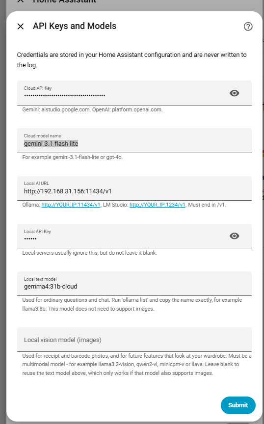

<i>Carefully input your respective API keys and model names. Ensure local URLs include the port and end with /v1.</i>

### Step 7: Customize Trigger Words & Advanced Settings
Configure the voice keywords that will trigger specific AI actions. 
* **Multilingual Support:** You don't have to use English! You can write these trigger words in your native language (Hebrew, Spanish, etc.) so the assistant perfectly understands your natural speech.
* **⚠️ Danger Zone (`delete_on_remove`):** If you check this box, uninstalling the integration will **permanently delete** your entire Home Organizer database (including all your saved items, rooms, and images). It is highly recommended to leave this unchecked to keep your data safe in case you ever need to reinstall the integration!

  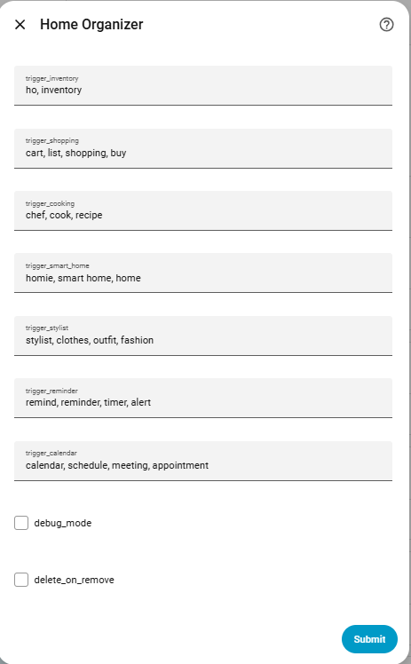

<i>Set your custom wake words and carefully review the delete_on_remove checkbox.</i>

### Step 8: Welcome to Home Organizer!
Once the setup is complete, a new **HO-AI** icon will appear in your Home Assistant sidebar. 

**No Hidden Menus:** There are no complicated settings screens or hidden menus to learn! The entire interface is designed to be completely intuitive. Simply click the **Pencil icon (✏️)** in the top right corner to enter Edit Mode, and all your management options (adding, renaming, deleting, and changing icons) will instantly appear exactly where you need them. 

  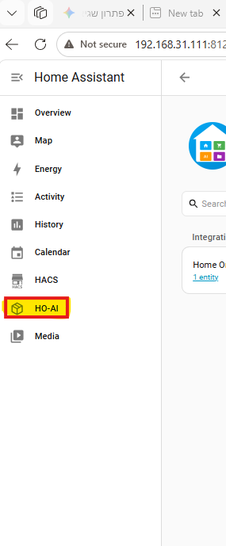
  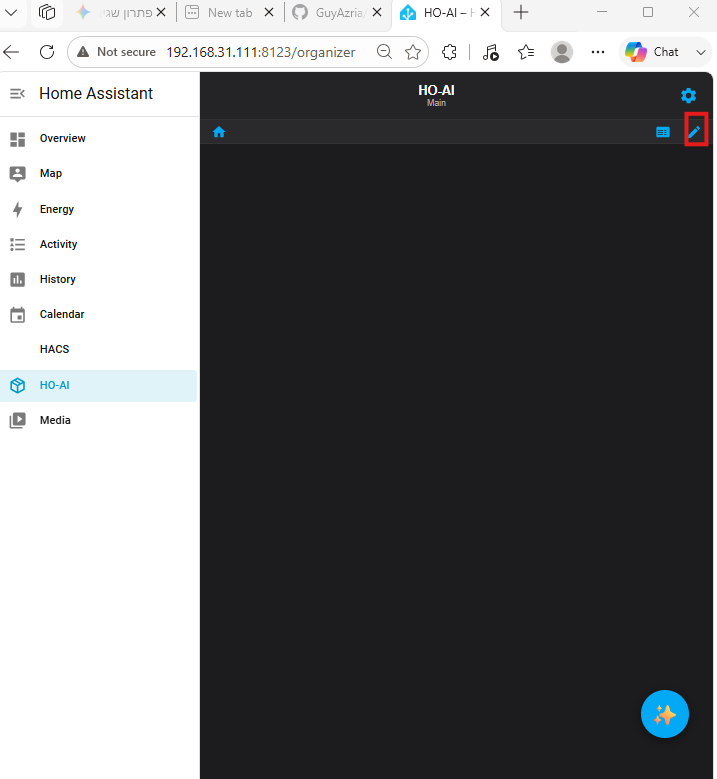

<i>Click the new HO-AI sidebar icon. On your first launch, the screen will be empty. Click the <b>Pencil icon (✏️)</b> in the top right corner to start creating your rooms and adding items!</i>

 ### 2. Setting up Zones and Rooms
To start building your home layout, click the **Pencil Icon (✏️)** in the top right corner of the navigation bar to enter **Edit Mode**.

**Creating a Zone:**
Click the **Add Zone** button at the bottom of the screen to create a broad area. Then, click the small pencil icon next to the zone's title to rename it (for example, "FIRST FLOOR").

  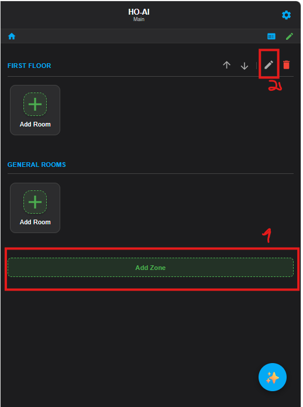

<i>Click "Add Zone" (1), then use the pencil icon (2) to give your zone a custom name.</i>

**Adding a Room:**
Once your zone is ready, click the large green **+ Add Room** button inside it to create a specific room (like a Kitchen or a Garage).

  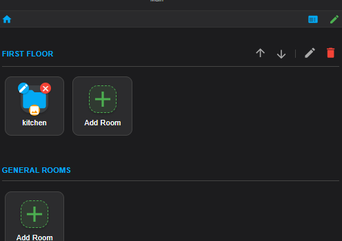

<i>A new "kitchen" room has been added to the FIRST FLOOR zone. The blue and red icons indicate you are still in Edit Mode.</i>

### 3. Customizing Icons
While still in **Edit Mode (✏️)**, you can personalize the look of your rooms to make them easily recognizable. Click the small **picture icon** on the corner of any room folder to open the Icon Picker.

  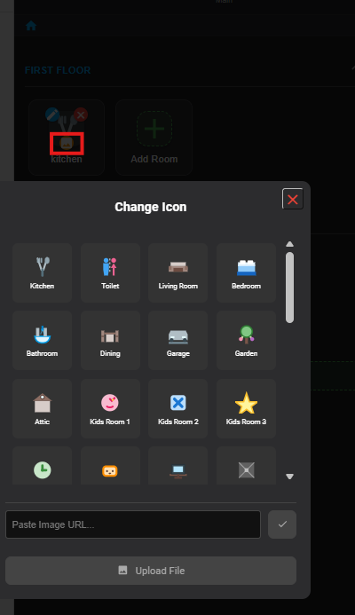

<i>Click the picture icon (highlighted in red) to open the menu. You can select a beautiful built-in 3D icon, paste a direct image URL, or upload your own custom image!</i>

 
### 8. Setting up the Voice Assistant & HO_Mind_AI

**Part A: Set HO-AI as Your HA Conversation Agent**
To make Home Organizer the default "brain" for voice commands across your entire smart home:
1. In your main Home Assistant menu, navigate to **Settings** > **Voice assistants**.
2. Click on the default **Home Assistant** assistant (or click **+ Add Assistant** to create a new one).
3. In the window that opens, scroll down to the **Conversation agent** section and select **HO-AI Agent** from the dropdown menu. Save your changes.

  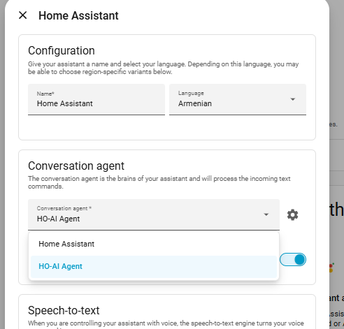

<i>Change the Conversation agent to HO-AI Agent so your new AI can process all incoming voice and text commands.</i>

**Part B: Install & Configure HO_Mind_AI (Android Users Only)**
1. Open the HO dashboard on your phone. Go to the Chat screen, tap the Camera icon (📸), then the Gear icon (⚙️). Click **Download Android APK** and install.
2. Open the app and tap the Gear icon (⚙️) to open Settings.
3. **URL:** Enter your exact internal HA IP (e.g., `http://192.168.1.100:8123`).
4. **Token:** Generate a Long-Lived Access Token in your HA profile.
5. **Device ID:** Find your phone under HA Settings ➔ Devices. Look at your browser's address bar and copy the long string of characters at the very end of the URL. *(Pro-tip: Do this on a PC and WhatsApp the Token and ID to yourself!)*
6. Enable **Shake to Speak** to activate the Ghost Screen, choose your **Language**, and adjust the **Volume Override** so the assistant speaks aloud even if your phone is on silent!

### 🎙️ The Ultimate Voice Assistant Capabilities
HO can now be configured as your official **Home Assistant Conversation Agent**! You can speak naturally and ask for almost anything:
* **Smart Shopping List:** Say *"Add eggs to the shopping list,"* *"Clear my shopping list,"* or even ***"Send my shopping list to WhatsApp."***
* **Voice Inventory:** Add items directly to locations by saying, *"Add 3 batteries to the kitchen drawer."*
* **Your Personal Sous-Chef:** Want to bake? Ask, *"How do I make a cheesecake?"* The AI will instantly cross-reference your HO inventory, tell you what ingredients you have, offer to add missing ones to your shopping list, and guide you step-by-step. It will even **add automatic Home Assistant reminders and timers** while you cook!
* **Smart Reminders Assistant:** Say, *"Remind me in an hour to pick up the kids."* When the time comes, the reminder will return **as an audio voice message directly to the specific user's phone** who requested it!
* **Calendar Secretary:** Seamlessly manage your schedule. Just say, *"Add a meeting tomorrow morning with Mr. Bean,"* and it's booked.
* **Free-Speech HA Control:** Control your lights, switches, and devices using completely natural language, or ask for the time, weather, and daily news.

### 📱 `HO_Mind_AI` (Native Android Companion App) - Version: "2026.6.16"
Modern browsers often block camera and microphone access over local HTTP connections. We built **HO_Mind_AI**—a native Android companion app that fixes this and adds serious magic:
* **🎧 True Hands-Free Wireless Control (AirPods Supported):** The ultimate smart home experience! Simply click the button on your Bluetooth headset, hear an instant activation beep, speak your command, and get the AI's verbal response directly in your ear. This completely eliminates the need to shout *"Hey Google"* or use any other wake words. Full hardware button interception works seamlessly even when the screen is locked or external music apps (like Spotify) are running.
* **"Ghost Screen" & Shake-to-Speak:** Run the app silently in the background as a transparent overlay. Enable "Shake to Speak" to wake the assistant with a simple physical shake—no need to press any buttons!
* **📺 Live Teleprompter Notification:** The Android Media Player widget (on the lock screen and quick settings) has been repurposed. Instead of showing static song details, it dynamically updates in real-time to display the exact words you are dictating to the Speech-To-Text engine.
* **🔋 Dynamic BT Toggle (Battery Saver):** A realtime `BT: ON/OFF` toggle button on the Ghost Screen. When ON, the app asserts absolute media dominance. When OFF, it completely destroys the internal media session and releases `AudioFocus`, returning full hardware control to your default music players to save battery.
* **🎙️ Continuous Smart Transcription:** The STT engine now operates in a continuous loop, automatically handling silence timeouts and seamlessly restarting itself to allow for long, uninterrupted dictation sessions.
* **Native Google STT:** Uses Google's highly accurate native Speech-to-Text engine, drastically outperforming local Whisper models.
* **Unblocked Camera:** Flawless, instant camera access for visual tasks (like barcode and invoice scanning) on local networks. *(Note: Invoice and barcode scanning are visual features performed via the camera button, not via voice commands).*
---

## 🛠️ Under the Hood: The Android Audio Architecture Hacks

Intercepting Bluetooth hardware buttons on modern Android devices (12+) requires complex workarounds. This release implements several "Production-Grade" hacks used by professional PTT (Push-To-Talk) apps like Zello:

1. **The "KeepAlive" A2DP Silence Loop:** Android OS and smart headsets will disable hardware media buttons if no audio is actively playing. To force the OS to recognize our app as the primary media client, we run a continuous `AudioTrack` loop playing absolute silence at `44.1kHz Stereo`. This keeps the Bluetooth A2DP channel open and locks routing to our app.
2. **Fake Media Metadata Injection:** Smart headsets (specifically Apple AirPods) will completely disable their physical touch controls on Android if they don't receive active Song/Artist metadata. We spoof this `MediaMetadata` via the `MediaSession` to trick the headset firmware into transmitting physical clicks.
3. **Android 12+ Background Launch Bypass:** Modern Android versions silently kill `BroadcastReceivers` attempting to launch a `ForegroundService` from the background. We bypassed this by routing the `ACTION_MEDIA_BUTTON` intent via `PendingIntent.GetService()` *directly* into the already-running Foreground Service's `OnStartCommand`.
4. **AVRCP Transport Control Catch-All:** Different smartphone manufacturers (especially Samsung) translate raw Bluetooth headset clicks (`KeyEvents`) into `TransportControls` before sending them to the app. We implemented explicit overrides for `OnPlay`, `OnPause`, `OnSkipToNext`, and `OnRewind` to ensure no matter how the OS translates the physical click, the Voice Assistant is triggered.

---

## 💡 Notes for Apple AirPods Users (on Android)

If you are using Apple AirPods with this app on an Android device, please note the following hardware limitations:
* **In-Ear Detection:** AirPods will not transmit hardware clicks unless they detect they are physically inside your ear.
* **The iOS Configuration Trick:** AirPods store their tap-gestures locally on their internal chip. For the best experience on Android, connect your AirPods to an iPhone/iPad first, go to Bluetooth settings, and configure the Double-Tap action to **"Play/Pause"** for both ears. Once reconnected to your Android device, the hardware clicks will be captured perfectly by HO-Mind AI.

---

### 🧠 Processing Flexibility
Choose how your AI runs: **Local Only** (for ultimate privacy), **Cloud**, or a **Hybrid API** mode that utilizes the cloud but gracefully falls back to local processing if your connection drops.

**Privacy & External Services:**
While the core inventory database (SQLite) is 100% local and private, please note that the **Barcode Scanner** feature requires an active internet connection to identify scanned retail products. To fetch product names and details, the integration queries the following external public servers:
* **OpenFoodFacts** (`world.openfoodfacts.org`)
* **UPCItemDB** (`api.upcitemdb.com`)
* **DuckDuckGo** (`html.duckduckgo.com` - used strictly as a fallback search if the product is not found in the main databases).
---

## ✨ Core Features

### 🤖 Advanced AI Capabilities
* **Receipt & Invoice Scanning (Visual)** — Snap a photo or upload a PDF of your grocery receipt using the camera interface. The AI will automatically extract all items, quantities, and intelligently map them to your existing home locations.
* **Auto-Categorization & Icons** — The AI automatically assigns the correct Main Category, Sub-category, Measurement Unit (Kg, Liter, Units), and a beautiful 3D icon to every item it processes.
* **Smart "Review" Pipeline** — AI-extracted items go into a secure "Review Tab." Check, edit, confirm, or reject the AI's imports before they are permanently added.
* **Native Multilingual Support** — Chat and interact in English, Hebrew, Arabic, or any other language.

### 📦 Smart Inventory Management
* **Hierarchical Explorer** — Navigate through Rooms, Furniture, Shelves, and Boxes with unlimited depth.
* **Live Stock Tracking & Shopping Mode** — Instantly update stock. When an item hits `0`, it is marked **Out of Stock** and sent directly to your Shopping List.
* **Date Tracking & Management Tools** — Track expiration dates, Rename, Move (Cut/Paste), Duplicate, and Delete functions.

### 📸 Camera & Visual Tools
* **AI Background Removal** — Take photos of your items directly in the app. The built-in camera tool automatically filters out messy backgrounds to create clean, professional item thumbnails.
* **Visual Search** — Use photos to identify unknown items and locate where they are stored in your home.

---

## 📖 User Manual & Visual Guide

Welcome to Home Organizer! This step-by-step guide will walk you through setting up your home, managing your items, and unleashing the power of the AI Assistant.

### 1. Personalizing Your Settings (Language & Themes)
Click the **Gear Icon (⚙️)** in the top right corner of the navigation bar.
* **Language:** Select your preferred language and the entire interface—including text direction (LTR/RTL)—will instantly adapt.
* **Theme:** Choose between a sleek **Dark Theme** or a clean **Light Theme**.

  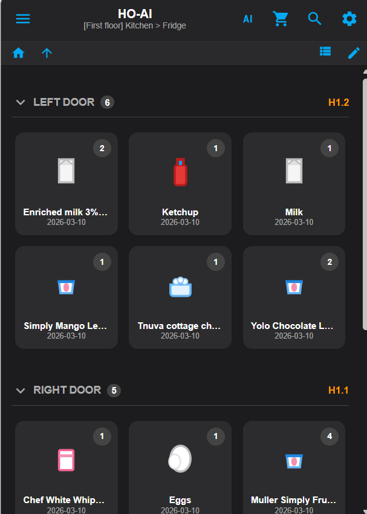
  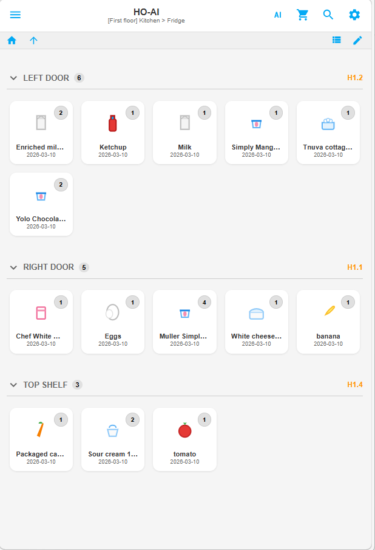

### 2. Setting up Zones and Rooms
Click the **Pencil Icon (✏️)** in the top right to enter **Edit Mode**.
* Click **Add Zone** at the bottom to create broad areas like "First Floor".
* Inside those zones, click the large green **+ Add Room** button to create specific rooms like "Kitchen".
* *Tip: You can use the up (↑) and down (↓) arrows to reorder your zones and rooms!*

  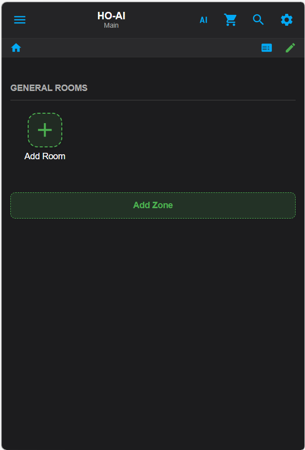
  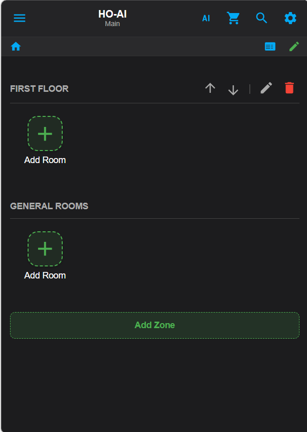
  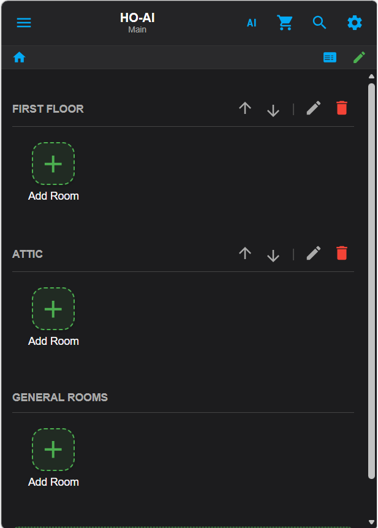

### 3. Customizing Icons
While still in **Edit Mode (✏️)**, click the picture icon on the corner of your room folders to open the **Icon Picker**.
* Browse through hundreds of beautiful 3D icons, or use the **Upload File** button to paste an image URL directly!

  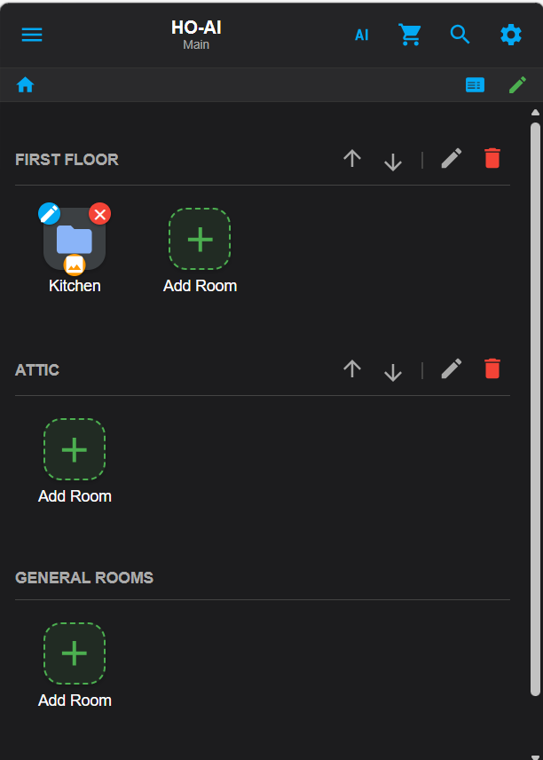
  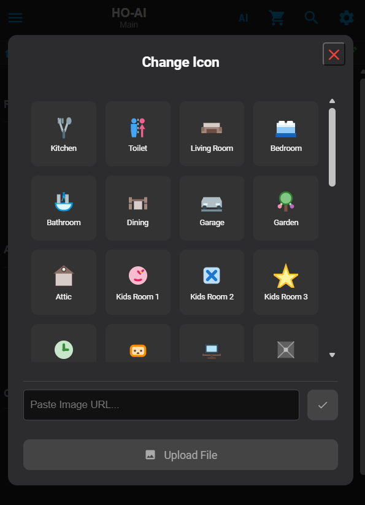

### 4. Storage Locations & Sublocations
Click on a Room (e.g., Kitchen) to enter it. Add a **Storage Location** (like "Fridge"), click into it, and add a **Sublocation** (like "Top Shelf"). This hierarchy ensures you always know *exactly* where an item is.

  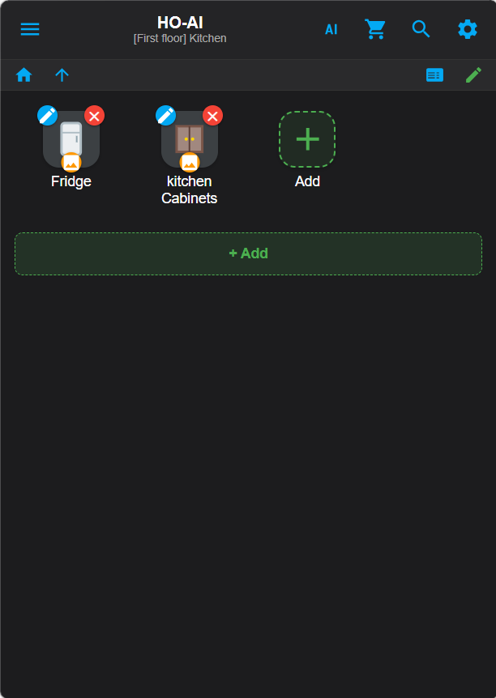
  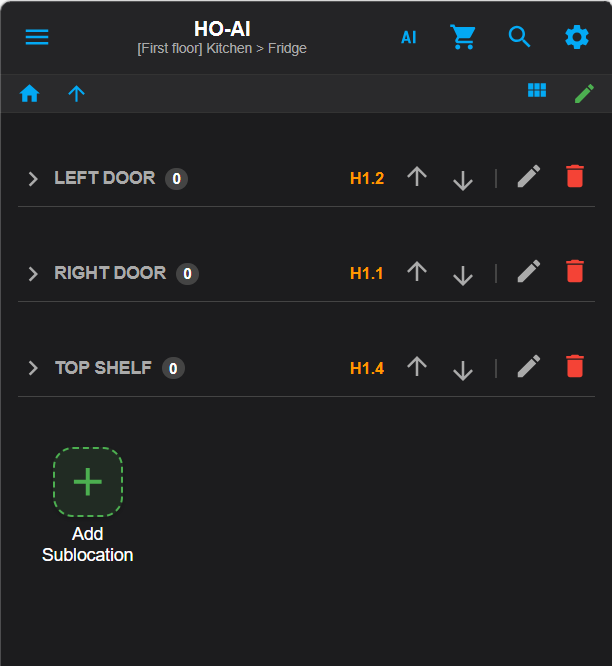

### 5. Adding and Managing Items manually
Turn off **Edit Mode**. Navigate to a sublocation and click **+ Add** to create a new item manually.
* Categorize it, assign expiration dates, and use the Camera icon to snap a real photo of the item using the built-in AI Background Removal tool!

  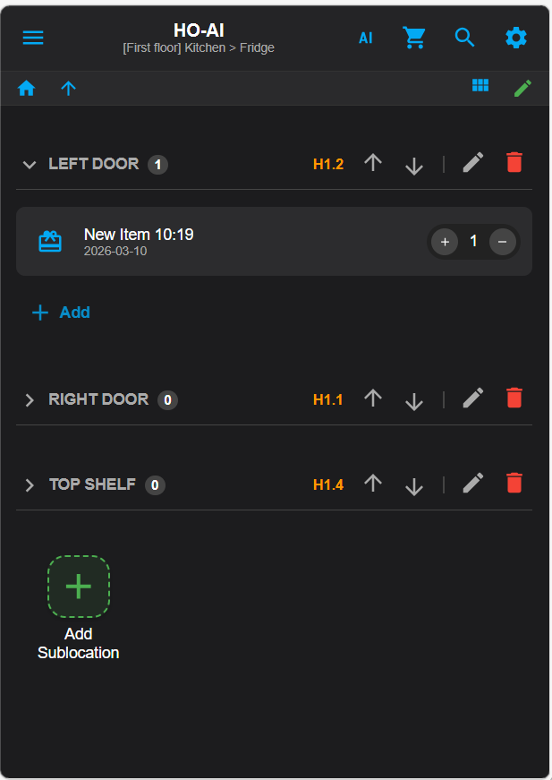
  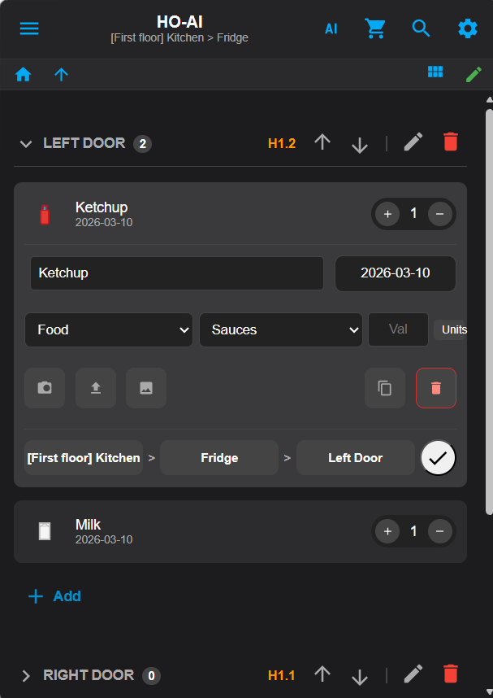
  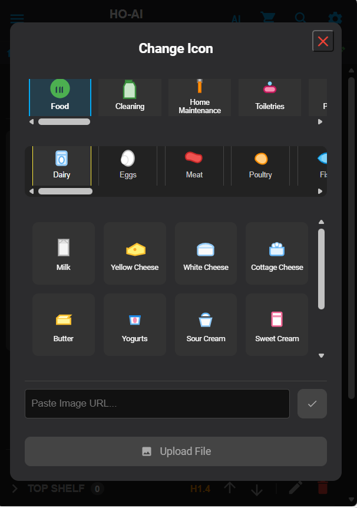

### 6. Grid View & Live Tracking
Use the **View Toggle** icon in the sub-bar to switch between a detailed List View and a beautiful visual **Grid View**. Hit the **+** or **-** buttons to update how much of an item you have left.

  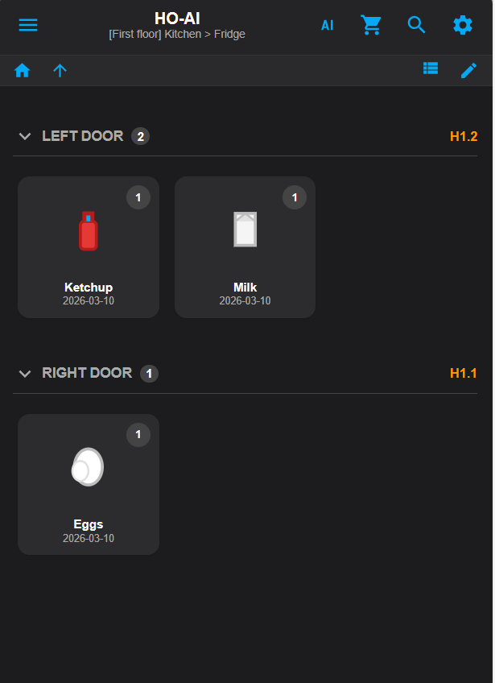
  

### 7. Invoice Scanning & AI Chat
Click the **Robot Icon (🤖)** in the top bar to open your personal AI Chat Assistant. 
1. Click the **Camera Icon** or the **Upload Icon** to attach a grocery receipt.
2. The AI will read the receipt, translate it, map the items to your existing rooms, apply icons, and send them to your **Review Tab** (inside the Shopping Cart menu) for approval.
3. You can also chat naturally via text or voice to manage your inventory and HA devices.

  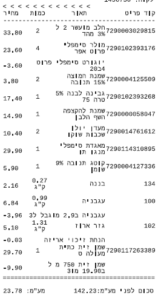
  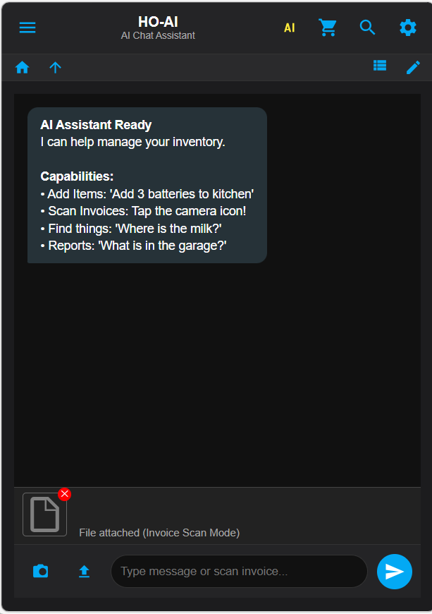
  
  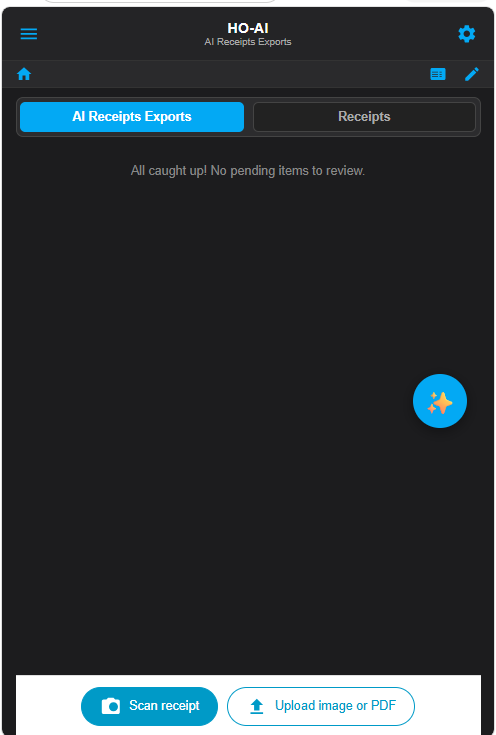

### 8. Setting up the Voice Assistant & HO-Mind AI

**Part A: Set HO as Your HA Voice Assistant**
1. In your main Home Assistant menu, go to **Settings ➔ Voice Assistants**.
2. Click **+ Add Assistant**.
3. Under **Conversation Agent**, select **HO-AI Agent** (`conversation.ho_ai_agent`). Save.

**Part B: Install & Configure HO-Mind AI (Android Users Only)**
1. Open the HO dashboard on your phone. Go to the Chat screen, tap the Camera icon (📸), then the Gear icon (⚙️). Click **Download Android APK** and install.
2. Open the app and tap the Gear icon (⚙️) to open Settings.
3. **URL:** Enter your exact internal HA IP (e.g., `http://192.168.1.100:8123`).
4. **Token:** Generate a Long-Lived Access Token in your HA profile.
5. **Device ID:** Find your phone under HA Settings ➔ Devices. Look at your browser's address bar and copy the long string of characters at the very end of the URL. *(Pro-tip: Do this on a PC and WhatsApp the Token and ID to yourself!)*
6. Enable **Shake to Speak** to activate the Ghost Screen, choose your **Language**, and adjust the **Volume Override** so the assistant speaks aloud even if your phone is on silent!

## 📋 Requirements
* Home Assistant 2024.1.0 or newer
* **AI Provider API Key or Local URL**: Required for AI chat, receipt scanning, and smart categorization (Gemini, OpenAI, Claude, Ollama, or LM Studio).

---

Made with ❤️ for the Home Assistant community by Guy Azria

