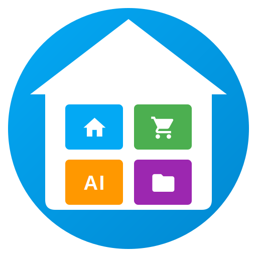

# **Home Organizer**

  
  
</div\>  

**The complete, fully integrated home inventory system for Home Assistant.**

**Written by Guy Azaria with AI help.**

This integration adds a dedicated **Full-Screen App** to your Home Assistant sidebar (Custom Panel). It allows you to organize your home items in unlimited nested folders, manage stock levels, take photos, generate smart shopping lists, and utilize Google AI for automatic item recognition.

## **✨ Features**

* **Sidebar App:** Installs as a native panel in Home Assistant. No Lovelace/Dashboard configuration required.  
* **Hierarchical Explorer:** Navigate through Rooms \> Furniture \> Shelves \> Boxes. No depth limit.  
* **Smart Inventory:**  
  * **Live Stock:** \+ and \- buttons update stock immediately.  
  * **Shopping Mode:** A dedicated view showing *only* items that are out of stock (Qty 0), grouped by location.  
* **🤖 AI & Camera Integration:**  
  * **Auto-Name:** Take a picture, click the Sparkles (✨) icon, and let AI name the item for you.  
  * **Visual Search:** Take a picture of an object to find where it is stored in your house.  
  * **Item Photos:** Attach photos to items for easy identification.  
* **Date Management:** Track when items were added. Search by Day, Week, Month, or Year.  
* **Edit Tools:** Rename, Cut & Paste (Move), Delete, and Image updates.  
* **Zero Config:** Truly Plug & Play.

## **🛠️ Prerequisites**

To allow the system to save images taken by your camera to the local storage, you **must** add the following to your configuration.yaml file:

homeassistant:  
  allowlist\_external\_dirs:  
    \- "/config/www"

*Restart Home Assistant after adding this line.*

## **📥 Installation**

### **Option 1: HACS (Recommended)**

1. Open **HACS** \> **Integrations**.  
2. Click the **Menu (⋮)** \> **Custom repositories**.  
3. Paste the URL of this repository: https://github.com/GuyAzria/home-organizer  
4. Select Category: **Integration**.  
5. Click **Add**, then find **Home Organizer** in the list and click **Download**.  
6. **Restart Home Assistant**.

### **Option 2: Manual**

1. Download the custom\_components/home\_organizer folder from this repository.  
2. Copy it to your Home Assistant's config/custom\_components/ directory.  
3. Restart Home Assistant.

## **⚙️ Setup**

1. Go to **Settings** \> **Devices & Services**.  
2. Click **Add Integration**.  
3. Search for **Home Organizer**.  
4. **(Optional but Recommended)** Enter your **Google Gemini API Key** in the setup window. This enables the AI Auto-Name and Visual Search features.  
5. Click **Submit**.

**Result:** A new icon named **"Organizer"** ("ארגונית") will appear in your Home Assistant sidebar. Click it to start.

## **📖 User Guide**

### **1\. Navigation Bar (Top)**

* **⬆️ Up Arrow:** Navigate back to the parent folder.  
* **Title Area:** Displays your current location (e.g., Main \> Kitchen \> Fridge).  
* **🛒 Cart Icon:** Toggles **Shopping List Mode**.  
* **🔍 Magnifying Glass:** Toggles **Search Mode**.  
* **✏️ Pencil Icon:** Toggles **Edit/Add Mode**.

### **2\. Adding New Items & AI Features**

Click the **Pencil (Edit)** icon to reveal the **Add Panel** at the bottom of the screen.

#### **Manual Add**

1. Type the name in the text box.  
2. Check the date (defaults to today).  
3. Click **Folder** (to create a location) or **Item** (to create a product).

#### **📸 Camera & AI Auto-Name ✨**

1. Click the **Camera Icon** in the Add Panel.  
2. Take a picture of the item.  
3. **Option A (Manual Name):** Type the name yourself and click "Item". The photo will be attached.  
4. **Option B (AI Name):** Click the **Sparkles (✨)** icon.  
   * The AI will analyze the image.  
   * It will automatically fill the name field for you (e.g., "Coca Cola Bottle").  
   * Click **Item** to save.

### **3\. Managing Inventory**

#### **Browsing**

* Click on **Folders** to dive deeper into your hierarchy.  
* Click on **Items** to expand them and reveal detailed controls.

#### **Adjusting Stock**

* **Quick Change:** Use the ➖ / ➕ buttons on any item row. The database updates immediately.  
* **Mark as Fresh:** Expand the item and click **"Update"**. This sets the quantity to the current value AND updates the "Last Updated" date to today.

#### **Shopping List Mode (🛒)**

1. Click the **Cart Icon**.  
2. The view changes to show **only missing items** (Quantity \= 0), grouped by their location.  
3. **Restocking:** Click the **(+)** button next to an item you just bought. The item quantity becomes 1, and it immediately disappears from the list (returning to normal inventory).

### **4\. Search & Visual Search 🔍**

Click the **Magnifying Glass** to open the search bar.

* **Text Search:** Type a name (e.g., "Batteries"). The results will show items found **within the current folder and its sub-folders**.  
* **AI Visual Search 📷:**  
  1. Click the **Camera Icon** inside the Search Bar.  
  2. Take a picture of an object you are holding.  
  3. The AI will identify the object and search your inventory for matches.  
* **Date Filters:** Use the chips below the search bar (Week, Month, Year) to filter items by when they were last updated.

### **5\. Advanced Editing**

Click on an item row to **Expand** it.

* **Rename:** Change the text in the name field.  
* **Change Date:** Click the date picker to backdate or postdate an item.  
* **Update Photo:** Click the small camera icon inside the expanded card to retake the item's photo.  
* **Cut & Paste (Move):**  
  1. Click the **Scissors (✂️)** icon.  
  2. Navigate to the new destination folder.  
  3. Click the **Paste** button that appears at the top.  
* **Delete:** Click the **Trash Can (🗑️)** icon.

## **📄 License**

This project is licensed under the MIT License \- see the [LICENSE](https://www.google.com/search?q=LICENSE) file for details.
